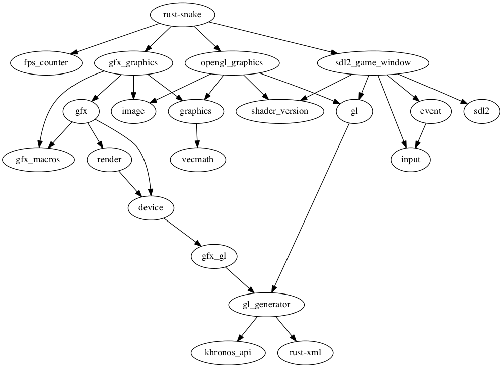

rust-snake - or - Sea Snake Escape
==========

A sea snake game in Rust using the Piston game engine
To run it you need <a href="http://www.libsdl.org/" target="_blank">SDL2</a>

## How to play

Use the arrow keys to control the diver.
When you lose or win, hit `Enter` to restart.
You can also exit with `Esc`.


*Reach the surface before the sea snakes get you!*

This project serves as a test project for the [Rust-Graphics](https://github.com/bvssvni/rust-graphics) API and [Piston](https://github.com/bvssvni/piston) game engine. The main goal is to improve Rust-Graphics. Do not expect it to have high quality as a game.

It was also my entry game for <a href="http://www.ludumdare.com/compo/ludum-dare-29/?action=preview&uid=19918" target="_blank">Ludum Dare 29</a>

## Building Instructions

Add the dependencies and add the '.rlib' files to '/target/cpu-vendor-os/lib/':

In the Terminal window, navigate to the project folder and type:

```
cargo run
```

## Dependencies



